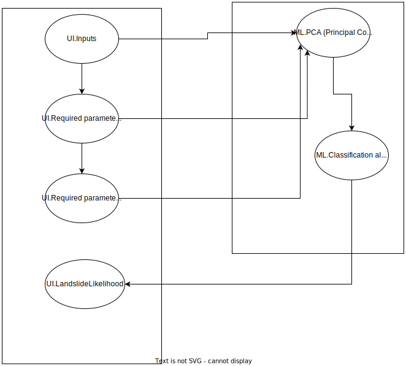

[](https://www.apache.org/licenses/LICENSE-2.0) [](https://developer.ibm.com/callforcode/solutions/projects/get-started/)

# No More Landslides

- [Project summary](#project-summary)
  - [The issue we are hoping to solve](#the-issue-we-are-hoping-to-solve)
  - [How our technology solution can help](#how-our-technology-solution-can-help)
  - [Our idea](#our-idea)
- [Technology implementation](#technology-implementation)
  - [IBM AI service(s) used](#ibm-ai-services-used)
  - [Other IBM technology used](#other-ibm-technology-used)
  - [Solution architecture](#solution-architecture)
- [Presentation materials](#presentation-materials)
  - [Solution demo video](#solution-demo-video)
  - [Project development roadmap](#project-development-roadmap)
- [Additional details](#additional-details)
  - [How to run the project](#how-to-run-the-project)
  - [Live demo](#live-demo)
- [About this template](#about-this-template)
  - [Contributing](#contributing)
  - [Versioning](#versioning)
  - [Authors](#authors)
  - [License](#license)
  - [Acknowledgments](#acknowledgments)


## Project summary

### The issue we are hoping to solve
The occurrence of landslides in hilly areas of the world have resulted in the loss of thousands of lives and injuries to millions more. They not only affect humans, but wildlife too.[1](#1)

### How our technology solution can help

Provides a likelihood estimate of an upcoming landslide in a region

### Our idea
Landslides are a threat to the local humans and wildlife, endangering the lives and households of a lot of people living in regions susceptible to them. It has also been observed that since landslides destroy a lot of public infrastructure, it is significantly difficult for assistance to reach the affected areas. Generally, they tend to occur in areas with a rapid population and economic growth[2](#2). We have obtained good quality data related to landslides over the past decade. Following that, we used AI services to identify the most important causative factors for a landslide and trained a classification model using those that implements the Random Forest algorithm. The result of this model is the likelihood of a landslide occurring in the region in the near future. We have also implemented a user-friendly and minimalistic GUI that prompts the user for these causative factors and also outputs the result. We have taken into consideration that all the factors may not be available with the user due to poor data maintenance and hence we only expect some of the most important ones and assume reasonable defaults for the rest. We were not able to find an existing comprehensive solution taking into account all the possible causative factors and zeroing-in on them. Our model guarantees high precision metrics as well as tested on the test data.

## Technology implementation

### IBM AI service(s) used


- [watsonx.ai](https://www.ibm.com/products/watsonx-ai) - Used AutoAI to identify key parameters and train the model and the Jupyter notebook feature to write and test code.


### Solution architecture

Diagram and step-by-step description of the flow of our solution:




## Presentation materials

Coming soon

### Solution demo video

Coming soon

### Project development roadmap

The project currently does the following things.

- Accept user inputs for the causative features identified
- Classification algorithm
- Present the likelihood the user through the UI.

In the future we plan to...

See below for our proposed schedule on next steps after Call for Code 2023 submission.

Coming soon

## Additional details

**Real time simulation of obtaining geological-information through sensors of area to be monitored for landslides ( Phase-2 deployment plan )**

To predict the landslides for a particular region its significant to monitor the factors like temperature,humidity,weather,soil etc of
that particular region.
We can acheive this by planting various sensors in that region. Below we discuss how we can integrate DHT11 sensor with Aurdino to measure the humidity and temperature of the region

**Components and supplies:**
1. DHT11 Temperature and Humidity sensor
2. Arduino UNO
3. Breadboard
4. Jumper wires

**Apps and platforms:**
1. Arduino IDE

**Build the circuit**


**Details about the code:**
We need to follow these instructions to make it work: 
1. Add the library to the Arduino IDE. 
2. Upload the code. 
3. When the code is uploaded, open the Serial Monitor and set the baud rate to 9600. 
4. You will see the humidity and temperature.

**Code:**
The code for receiving the data from the DHT11 and printing it out on the serial monitor.

```
#include <dht11.h>
#define DHT11PIN 4

dht11 DHT11;

void  setup()
{
  Serial.begin(9600);
 
}

void loop()
{
  Serial.println();

  int chk = DHT11.read(DHT11PIN);

  Serial.print("Humidity (%): ");
  Serial.println((float)DHT11.humidity, 2);

  Serial.print("Temperature  (C): ");
  Serial.println((float)DHT11.temperature, 2);

  delay(2000);

}
```


### How to run the project

INSTRUCTIONS: In this section you add the instructions to run your project on your local machine for development and testing purposes. You can also add instructions on how to deploy the project in production.
1. Deploy the application on your local system.
2. Log into http://localhost:5000/
3. Enter all the mandatory fields and as many of the optional fields as known.

### Contributing

Please read [CONTRIBUTING.md](CONTRIBUTING.md) for details on our code of conduct, and the process for submitting pull requests to us.

### Versioning

We use [SemVer](http://semver.org/) for versioning. For the versions available, see the [tags on this repository](https://github.com/no-more-landslides/no-more-landslides/tags).

### Authors

<a href="https://github.com/no-more-landslides/no-more-landslides/graphs/contributors">
  
</a>

- **Ashwin Hendre** - Dummy data preprocessing, PCA, Documentation - [Ashwin-Persistent](https://github.com/Ashwin-Persistent)
- **Bhagyashri Gaikwad** - Obtaining data, Model testing, UI
- **Suraj Gudaji** - Model training, UI
- **Aniruddha Nayek** - Obtaining data, Simulation of obtaining geological-information through sensors

### License

This project is licensed under the Apache 2 License - see the [LICENSE](LICENSE) file for details.

### Acknowledgments

- [1]: https://www.britannica.com/science/landslide#/media/1/329513/209350
- [2]: https://www.britannica.com/science/landslide
